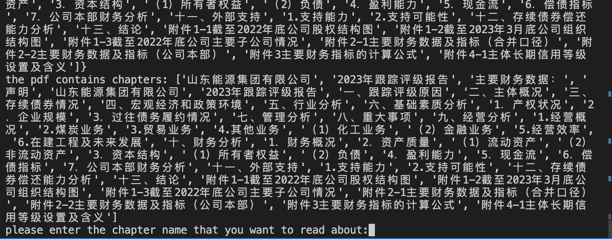
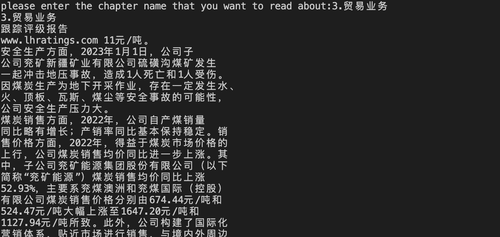

##PDF解析基础学习
内容：
#extraction_tools_summary.ipynb
- 简单列举一些从PDF中提取/读取文档的方法以及他们的试用情况：pdfplumber,pdfminer,PyPDF2最后选取了PyPDF2来继续试验，中间也有尝试用pattern match tool re 表格的正则来提取，但效果不佳
- 从PDF中提取所有图片，并保存为image{index}.jpeg

#extract_chapter_content.ipynb
- 从PDF中使用pdf2c提取所有的章节（包含子章节）名和他们的所在页码(table of content)
- 利用某一个想要查询的章节名，函数可以返回当前选中章节的所在页内容，包含前章节和后章节的部分内容

#extract_chapter_content.py
`sreach()`

复制粘贴任意章节名，回车确认

